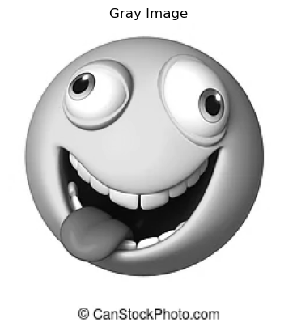
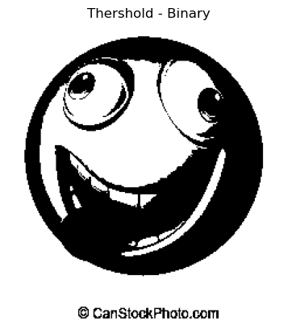
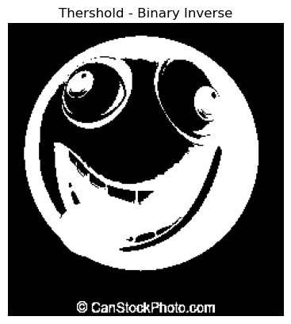
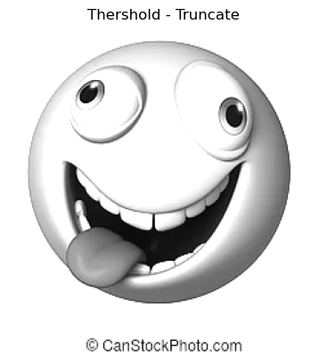
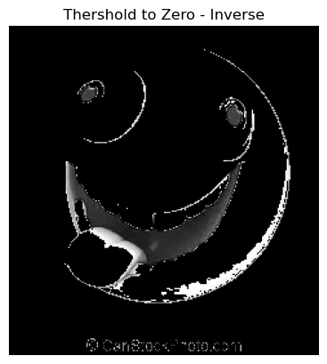
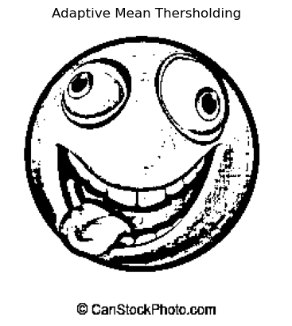
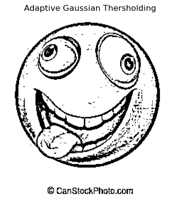
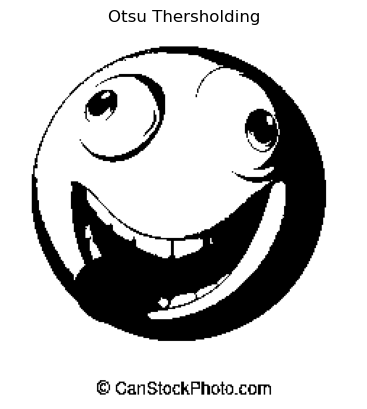

# Thresholding of Images
## Aim
To segment the image using global thresholding, adaptive thresholding and Otsu's thresholding using python and OpenCV.

## Software Required
1. Anaconda - Python 3.7
2. OpenCV

## Algorithm

### Step1:
Load the necessary packages.

### Step2:
Read the Image and convert to grayscale.

### Step3:
Use Global thresholding to segment the image.

### Step4:
Use Adaptive thresholding to segment the image.

### Step5:
Use Otsu's method to segment the image.

### Step6:
Display the results.

## Program


### Import Libraries & Define Functions
```
import cv2
import numpy as np
import matplotlib.pyplot as plt
    
def plot(name,img):
    plt.axis("off")
    plt.imshow(img,cmap="gray")
    plt.title(name)
```


### Convert image to grayscale
```
img = cv2.imread("gojo.png",1)
plot("Original Image",img)

img_gray = cv2.cvtColor(img,cv2.COLOR_BGR2GRAY)
plot("Gray Image",img_gray)

```


### Global Thresholding 

# Binary
```
ret,t_b   = cv2.threshold(img_gray,200,300,cv2.THRESH_BINARY)
plot("Thershold - Binary",t_b)
```


### Binary - Inverse
```
ret,t_b_i = cv2.threshold(img_gray,200,300,cv2.THRESH_BINARY_INV)
plot("Thershold - Binary Inverse",t_b_i)
```
### Turncate
```
ret,t_t = cv2.threshold(img_gray,200,300,cv2.THRESH_TRUNC)
plot("Thershold - Truncate",t_t)
```
### To Zero - Inverse
```
ret,t_tz_i =cv2.threshold(img_gray,86,255,cv2.THRESH_TOZERO_INV)
plot("Thershold to Zero - Inverse",t_tz_i)
```
### Adaptive Thresholding
### Mean
```
amt = cv2.adaptiveThreshold(img_gray,255,cv2.ADAPTIVE_THRESH_MEAN_C,cv2.THRESH_BINARY,11,2)
plot("Adaptive Mean Thersholding",amt)
```
### Gaussian
```
ag=cv2.adaptiveThreshold(img_g,255,cv2.ADAPTIVE_THRESH_GAUSSIAN_C,cv2.THRESH_BINARY,11,2)
plot("Adaptive Gaussian Thersholding",ag)
```
### Otsu's Thresholding
```
ret,otsu = cv2.threshold(img_gray,0,255,cv2.THRESH_BINARY+cv2.THRESH_OTSU)
plot("Otsu Thersholding",otsu)
```

## Output

### Original Image

### Gray Image


### Global Thresholding

### Binary Thresholding

### Binary Thresholding - Inverse

### Turncate Thresholding

### To Zero Thresholding 

### To Zero Thresholding - inverse



### Adaptive Thresholding
### Adaptive Thresholding - Mean

### Adaptive Thresholding - Gaussian


### Optimum Global Thesholding using Otsu's Method
### otsu's



## Result
Thus the images are segmented using global thresholding, adaptive thresholding and optimum global thresholding using python and OpenCV.

